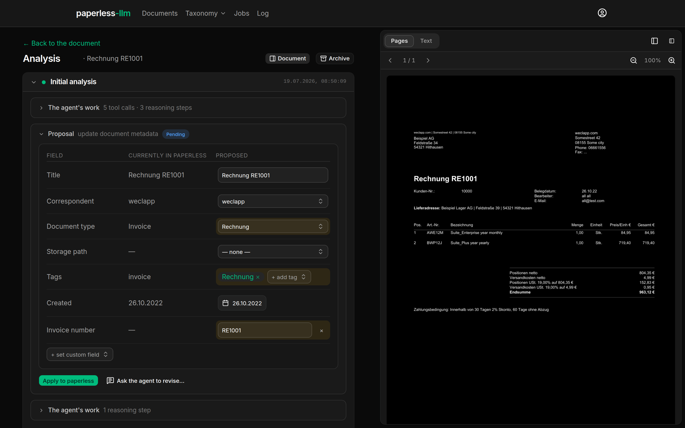
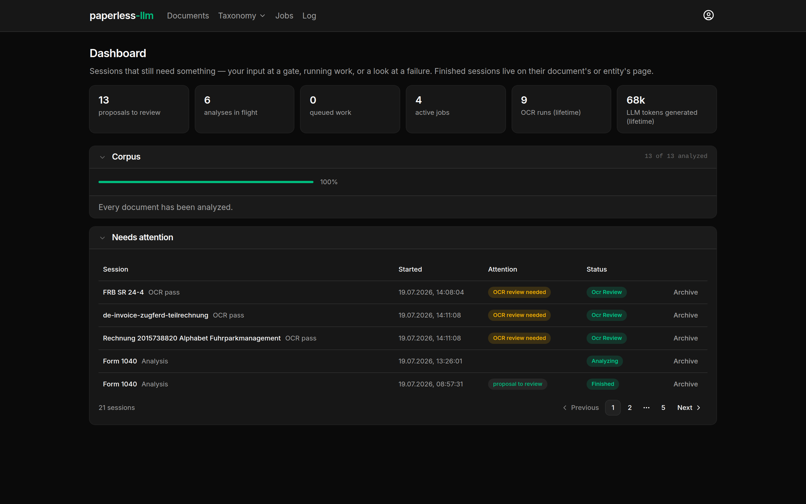
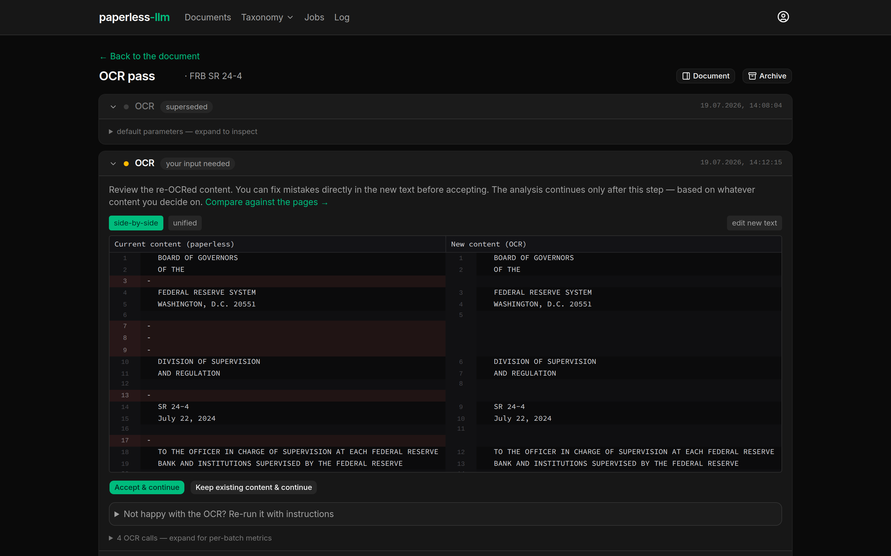
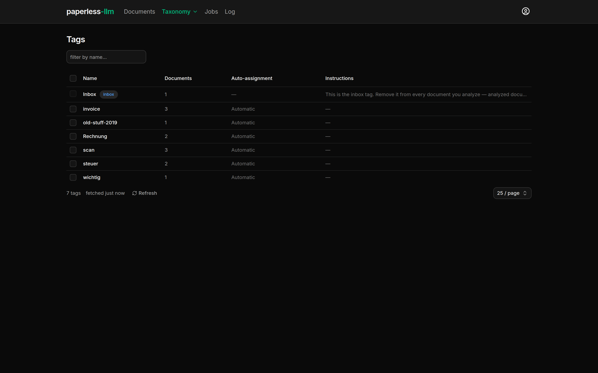
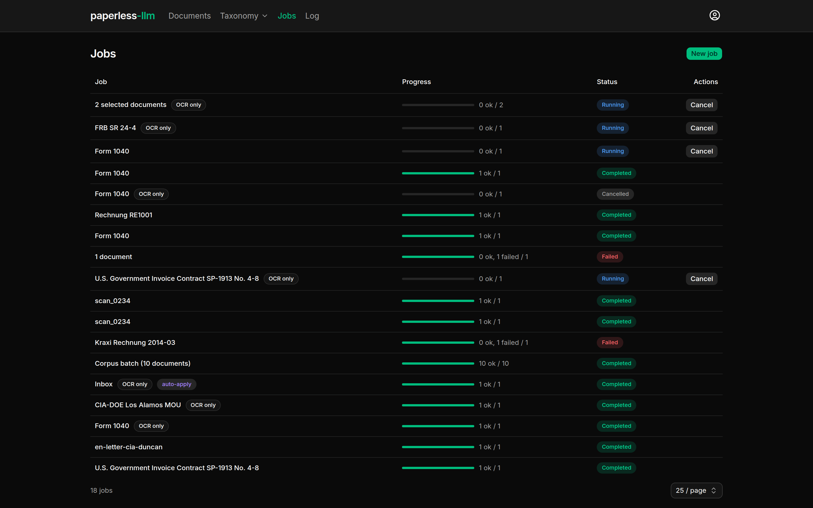

# paperless-llm

A local-LLM assistant that keeps your [paperless-ngx](https://docs.paperless-ngx.com/)
archive tidy — **without a single byte of your documents leaving your
network**.

<p align="center">
  
  <br>
  <em>The agent proposes metadata one change at a time — you judge each
  proposal against the actual document, then apply, edit, or ignore it.</em>
</p>

- **OCR that's actually good** — a local vision model re-reads scans
  into clean Markdown; you review the diff before anything is written.
- **Metadata proposals** — titles, correspondents, types, tags, dates:
  proposed one at a time, applied by you, journaled and revertible.
- **Taxonomy governance** — duplicate detection, merges, per-entity
  instructions the agent must obey.
- **Bulk jobs & webhook automation** — from "propose and wait" to
  "auto-apply with a full undo journal".

**Privacy by construction**: the codebase contains exactly one kind of
LLM integration — a local OpenAI-compatible endpoint. There is no cloud
provider code path to misconfigure.

## Screenshots

| Dashboard — what still needs you | OCR review gate — accept, fix, or keep |
| :---: | :---: |
| [](docs/assets/screenshots/dashboard.png) | [](docs/assets/screenshots/ocr-session.png) |
| **Taxonomy — govern tags & matching rules** | **Bulk jobs — pause, resume, retry** |
| [](docs/assets/screenshots/taxonomy-tags.png) | [](docs/assets/screenshots/jobs.png) |

## Quick start

```bash
cd deploy/production
cp .env.example .env   # paperless URL/token + your LLM endpoint
podman compose up -d   # (docker compose works too)
```

Open `http://your-host:8100`.

## Documentation

Full documentation (setup, configuration, usage, architecture) is
published at **<https://luminger.github.io/paperless-llm/>** and sourced
from [`docs/`](docs/index.md).

## Development

Backend: `cd backend && uv sync && uv run pytest`.
Frontend: `cd frontend && npm install && npm test`.
See [docs/development.md](docs/development.md).

## License

Licensed under the GNU Affero General Public License v3.0 or later
(SPDX `AGPL-3.0-or-later`). See [`LICENSE`](LICENSE).

    Copyright (C) 2026  Simon Brakhane
