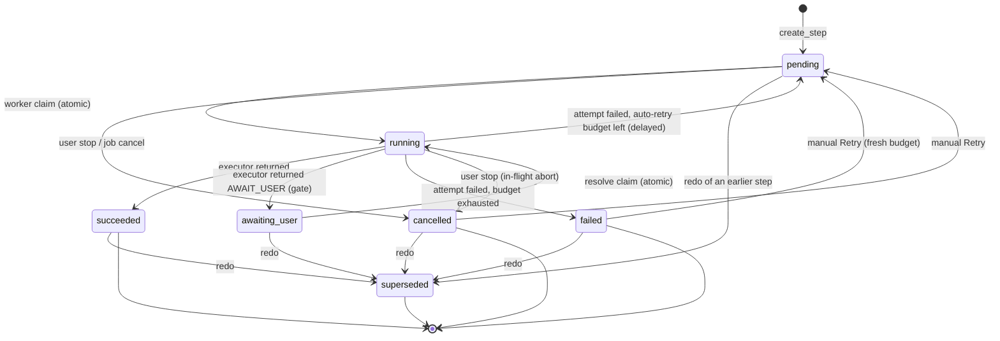
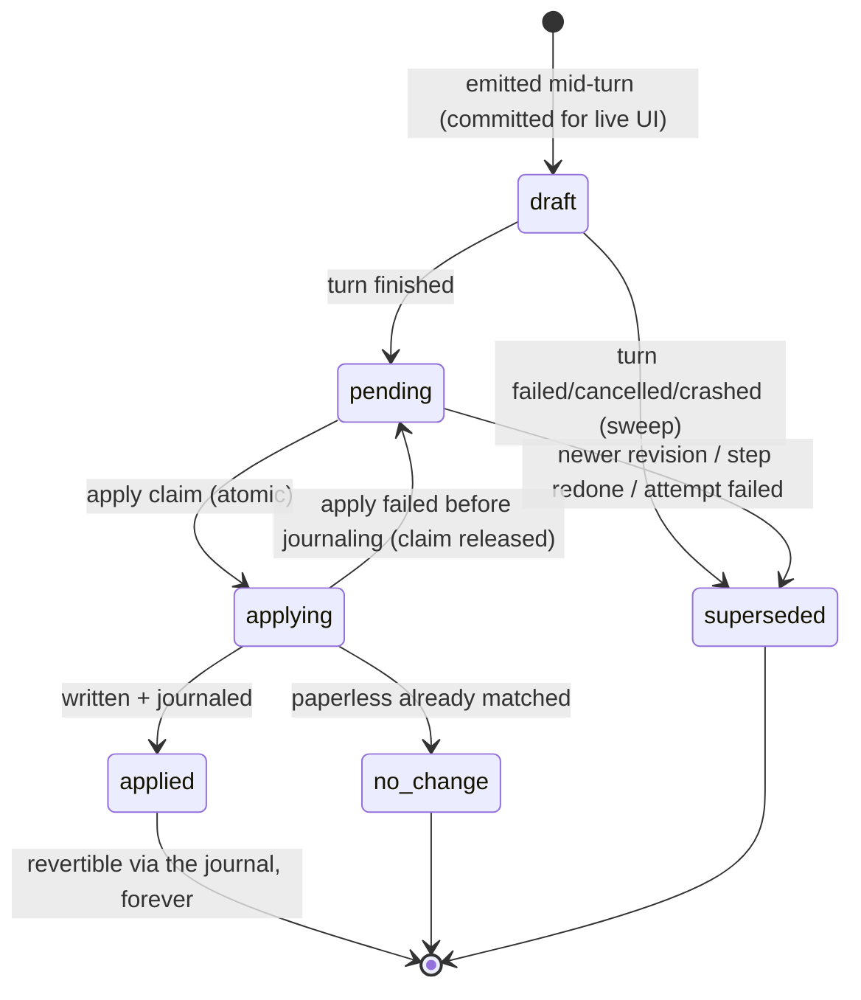

# The state machine

This document is the **normative** definition of every lifecycle in the
app: steps, sessions, proposals, and jobs. The code enforces the step
transitions centrally (`app/services/steps.py`, the engine — the single
writer of step state); everything else here is either derived from
steps or guarded by atomic claims. If code and this document disagree,
one of them has a bug — fix whichever is wrong, never let them drift.

Two design rules produce most of the guarantees:

1. **Steps are the only stored workflow state.** A session's
   `phase`/`status`/`error` are *derived* from its step list by a single
   writer (`sync_session`); job progress is derived at read time. There
   is no second copy to desynchronize.
2. **Every transient state has an owner that must exit it.** `running`
   steps belong to a worker, `applying` proposals to an apply call,
   `draft` proposals to an agent turn. Crash recovery (`recover()`)
   closes all three at startup, so no transient state survives a
   process death.

## Step lifecycle

States: `pending`, `running`, `awaiting_user`, `succeeded`, `failed`,
`superseded`, `cancelled`.

The full legal-transition relation lives in code as
`STEP_TRANSITIONS` and every mutation site asserts against it.
Notes on the non-obvious edges:

- `running → pending` is the **auto-retry**: the attempt is logged,
  `scheduled_at` delays the re-claim. Manual Retry resets the budget.
- `awaiting_user → running` is the resolve claim; if the resolver
  raises, the step returns to `awaiting_user` (claim released). A
  resolver's *side effects that already committed* (e.g. an applied
  internal proposal) stay — re-resolving is idempotent because applying
  an already-matching change verdicts as `no_change`.
- `superseded` is reached **only** through `redo_step`, which also
  supersedes every later step (their results were built on state the
  redo invalidates) and every *open* proposal of those steps.
- Crash: `recover()` re-queues `running` steps with budget left,
  fails the rest. Nothing else can be in flight at startup
  (single-process ownership).

**No-dead-end guarantee:** the terminal states are `succeeded`,
`failed`, `cancelled`, `superseded`. From `failed` and `cancelled` the
user always has Retry and Redo; from `succeeded` always Redo; from
`awaiting_user` always Resolve and Redo. `superseded` is final but by
construction has a successor step. `pending`/`running` belong to
workers and always exit (wall-clock caps bound every executor;
`recover()` covers process death).

## Session phase & status (derived, never stored independently)

`_derive(steps)` computes, from the **last non-superseded pipeline
step** (kind `ocr` or `analysis`):

| last pipeline step | state | phase |
| --- | --- | --- |
| ocr | pending | `queued` |
| ocr | running | `ocr_running` |
| ocr | awaiting_user | `ocr_review` (the gate) |
| ocr | failed | `ocr_running` (stage label; status says `failed`) |
| ocr | succeeded + resolution, `ocr_only` | `done` |
| ocr | succeeded + resolution, else | `analyzing` (analysis step follows in the same tx) |
| ocr | cancelled | `stopped` |
| analysis | pending | `queued` |
| analysis | running / awaiting_user / failed | `analyzing` |
| analysis | succeeded | `done` |
| analysis | cancelled | `stopped` |
| *(none — entity/chat sessions)* | — | `null` |

`status` is orthogonal: `running` if any step runs, `failed` if the
last live step failed, else `idle`. **Phase answers "where in the
pipeline", status answers "how it's going"** — a failed OCR is phase
`ocr_running` + status `failed`, and the UI must always render the
status (Error badge), never the phase alone, for failed sessions.

Chat steps never affect phase. `stopped` is not terminal: Retry on the
cancelled step revives the pipeline exactly where it stopped.

### The OCR gate (`ocr_review`)

Resolutions and their guarantees:

- **accept / edit** → internal `replace_content` proposal, applied
  immediately (journaled, revertible), then: analysis step (normal) or
  end (`ocr_only`).
- **keep existing** → nothing written, then: analysis step or end.
- **auto-resolve (`auto_native`)** — born-digital shortcut. In analyze
  pipelines: all pages native + similarity ≥ threshold. In **OCR-only
  runs** additionally the native text must be *equivalent* to the
  stored content (whitespace/case aside): an explicit re-OCR exists to
  change text, so any real difference must reach a decidable state
  (gate in review mode, journaled auto-write in auto mode) — never a
  finished session with an unactionable diff.
- **auto policy (`ocr_only` + auto)** → journaled write when the text
  changed, `unchanged` otherwise.

Every gate outcome sets `step.result.resolution` — a succeeded OCR step
without a resolution is illegal.

## Proposal lifecycle

States: `draft`, `pending`, `applying`, `applied`, `superseded`,
`no_change`. There is no "declined": unwanted proposals are revised
(superseded), left pending, or their session archived.

**Transient-state owners (the dead-end rules):**

- `draft` belongs to a *running* turn. When that turn's step finalizes
  as anything but success — failed attempt (retry scheduled or final),
  cancel — its open (`draft`/`pending`) unapplied proposals are swept to
  `superseded` in the same finalize transaction: the re-run emits fresh
  ones, stale ones must not linger. Startup `recover()` sweeps drafts
  whose step is no longer running (crash case).
- `applying` belongs to an in-flight apply call. In-process failure
  releases it back to `pending`. A crash mid-apply is released to
  `pending` by `recover()` — safe because re-applying is idempotent:
  if the write already reached paperless, the retry verdicts
  `no_change`.
- `pending` belongs to the user (or the auto policy). It always has
  exits: apply, supersede-by-redo, or the failed-attempt sweep.

**Auto-apply scope (injection guard).** Under `apply_policy=auto`
(webhook, bulk jobs) a turn's fresh `pending` proposals are applied
without review — but *only* those targeting the session's own bound
entity (the proposal's `entity_type`/`entity_id` equal the session's;
for document sessions a `create_entity` also qualifies when every
document it assigns is the session's own). The propose tools accept
arbitrary ids, so without this scope a prompt injection embedded in one
document's text could fan writes out to unrelated documents with zero
review. Cross-target proposals stay `pending` for the normal human
review flow and are audit-recorded (`auto_apply_deferred`, with the
proposal id and target); while any are open, the decision loop refuses
the auto-continuation, so the session honestly stops and waits.

Archived sessions refuse *forward* apply (409) but their journal keeps
reverting — archive is a wall for new writes, not a dead end for
history. Unarchive restores every action.

## Job lifecycle

Stored status is only authoritative for the sticky states `cancelled`
and `paused`; `queued`/`running`/`completed`/`failed` are derived from
the sessions at read time (`live_job_counts`).

- **pause** — a job-row flip; workers skip its pending steps (no step
  state is rewritten). Resume flips back. Running steps finish.
- **cancel** — cancels the job's pending steps, aborts running ones.
  Open gates (`awaiting_user`) survive: a user who later resolves one
  deliberately revives that single session; the job stays `cancelled`.
- **retry** — re-queues the job's failed/stopped sessions.

## Steering (`send_message`)

Chat steps append only when nothing is in flight (no
pending/running/awaiting step — 409 otherwise) and only after the
pipeline passed the gate (phases `queued`, `ocr_running`, `ocr_review`
refuse steering). `done` and `stopped` sessions accept steering; a
stopped pipeline is not resumed by chat — Retry does that.

## Invariants (tested)

1. Every step state is exited by at least one legal transition, or is
   terminal with a defined user action (Retry/Redo) — no dead ends.
2. All step-state writes go through the engine and match
   `STEP_TRANSITIONS` (atomic claims encode the from-state in their
   `WHERE`).
3. A session's phase/status/error are recomputed by `sync_session`
   after every step mutation — never edited directly.
4. After `recover()` no step is `running`, no proposal is `applying`,
   and no `draft` belongs to a non-running step.
5. A failed or cancelled step attempt leaves no open (`draft`/
   `pending`) unapplied proposals behind.
6. A succeeded OCR step carries `result.resolution`.
